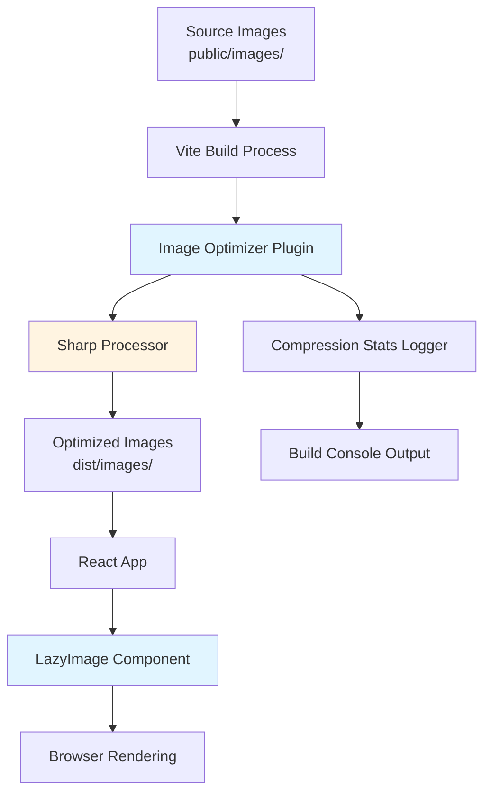
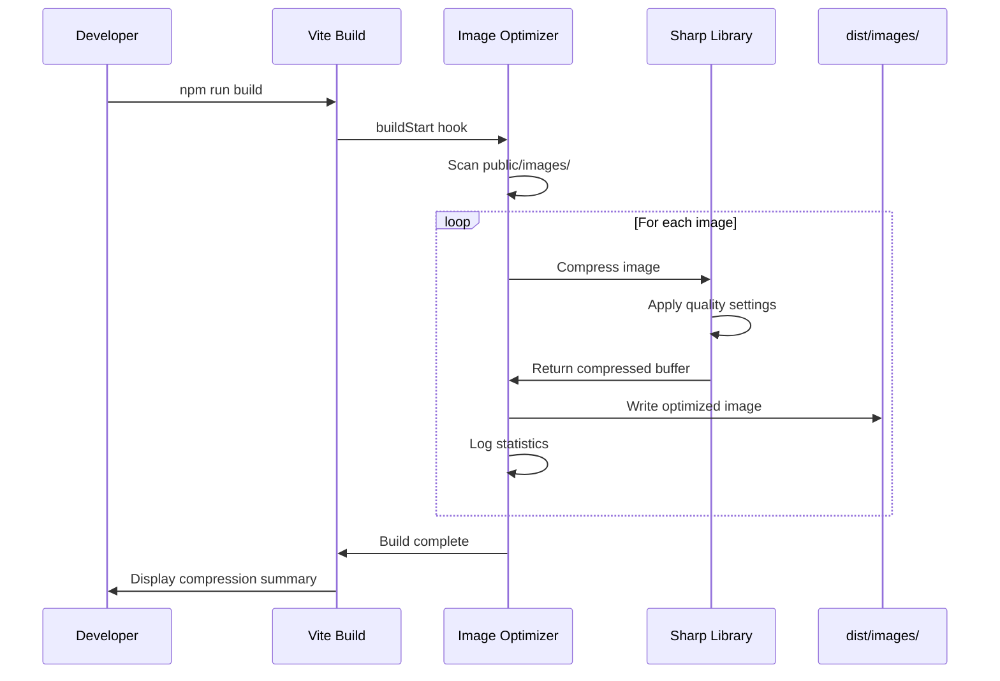

# Design Document: Image Optimization

## Overview

This design implements a comprehensive image optimization system for the non-pro-traveller travel website to reduce page load times from ~17MB to under 3MB. The solution consists of three integrated components:

1. **Build-time Image Compression**: A Vite plugin that automatically compresses images during the build process
2. **Lazy Loading System**: React components that defer image loading until needed
3. **Quality Preservation**: Compression settings optimized for travel photography

The system integrates seamlessly with the existing Vite build pipeline and React component architecture, requiring minimal changes to existing code while providing significant performance improvements.

### Key Design Decisions

- **Vite Plugin Architecture**: Leveraging Vite's plugin system ensures the optimizer runs automatically during builds without manual intervention
- **Sharp Library**: Using Sharp for image processing provides high-quality compression with fine-grained control over quality settings
- **Native Lazy Loading**: Prioritizing the browser's native `loading="lazy"` attribute ensures broad compatibility and optimal performance
- **WebP with JPEG Fallback**: Generating modern WebP formats alongside JPEG ensures optimal compression for modern browsers while maintaining compatibility
- **In-place Optimization**: Processing images directly in the public directory during build maintains existing file paths and URLs

## Architecture

### System Components



### Component Interactions

1. **Build Phase**:
   - Vite build process triggers the image optimizer plugin
   - Plugin scans public/images directory for image files
   - Sharp processor compresses each image to target size (200-300KB)
   - Optimized images are written to dist/images with original filenames
   - Compression statistics are logged to console

2. **Runtime Phase**:
   - React components use LazyImage wrapper for image rendering
   - LazyImage applies native `loading="lazy"` attribute
   - Browser handles lazy loading with 200px buffer
   - Fallback handling for failed image loads

### Data Flow



## Components and Interfaces

### 1. Image Optimizer Vite Plugin

**Purpose**: Automate image compression during the Vite build process

**Location**: `vite-plugin-image-optimizer.js` (new file in project root)

**Interface**:
```javascript
export default function imageOptimizer(options = {}) {
  return {
    name: 'vite-plugin-image-optimizer',
    async buildStart() { /* ... */ },
    async closeBundle() { /* ... */ }
  }
}
```

**Configuration Options**:
```javascript
{
  sourceDir: 'public/images',        // Source directory for images
  targetSizeMin: 200 * 1024,         // Minimum target size (200KB)
  targetSizeMax: 300 * 1024,         // Maximum target size (300KB)
  jpegQuality: 80,                   // JPEG quality (75-85 range)
  webpQuality: 80,                   // WebP quality
  generateWebP: true,                // Generate WebP versions
  logStats: true                     // Log compression statistics
}
```

**Key Methods**:

- `buildStart()`: Hook that runs at the start of the build
  - Scans the source directory for images
  - Validates image files
  - Initializes compression statistics

- `closeBundle()`: Hook that runs after bundle generation
  - Processes all discovered images
  - Writes optimized images to dist directory
  - Logs compression summary

- `compressImage(filePath, options)`: Core compression logic
  - Loads image using Sharp
  - Applies compression with quality settings
  - Iteratively adjusts quality to hit target size
  - Returns compressed buffer and statistics

- `generateWebP(filePath, options)`: WebP generation
  - Creates WebP version of image
  - Uses separate quality settings for WebP
  - Maintains same filename with .webp extension

### 2. LazyImage React Component

**Purpose**: Wrapper component that adds lazy loading to images

**Location**: `src/components/LazyImage.jsx` (new file)

**Interface**:
```javascript
export default function LazyImage({
  src,
  alt,
  className,
  onLoad,
  onError,
  placeholder,
  ...props
}) { /* ... */ }
```

**Props**:
- `src` (string, required): Image source URL
- `alt` (string, required): Alt text for accessibility
- `className` (string, optional): CSS classes
- `onLoad` (function, optional): Callback when image loads
- `onError` (function, optional): Callback when image fails
- `placeholder` (string, optional): Placeholder image URL
- `...props`: Additional HTML img attributes

**State Management**:
```javascript
const [imageState, setImageState] = useState('loading')
// States: 'loading', 'loaded', 'error'
```

**Behavior**:
- Renders img element with `loading="lazy"` attribute
- Shows placeholder during loading state
- Handles load/error events
- Applies appropriate CSS classes based on state

### 3. Compression Statistics Logger

**Purpose**: Track and report compression metrics

**Location**: Integrated within the Vite plugin

**Data Structure**:
```javascript
{
  totalOriginalSize: 0,
  totalOptimizedSize: 0,
  imagesProcessed: 0,
  compressionRatios: [],
  warnings: [],
  errors: []
}
```

**Output Format**:
```
Image Optimization Summary:
━━━━━━━━━━━━━━━━━━━━━━━━━━━━━━━━━━━━━━━━━━━━━━━━━━━━━━
Images Processed: 9
Total Original Size: 17.2 MB
Total Optimized Size: 2.4 MB
Total Reduction: 14.8 MB (86%)
Average Compression Ratio: 7.2:1
━━━━━━━━━━━━━━━━━━━━━━━━━━━━━━━━━━━━━━━━━━━━━━━━━━━━━━

Individual Images:
  ✓ photo1.jpg: 1.8 MB → 250 KB (86% reduction)
  ✓ photo2.jpg: 2.1 MB → 280 KB (87% reduction)
  ⚠ photo3.jpg: 4.2 MB → 310 KB (93% reduction, above target)
```

## Data Models

### ImageMetadata

Represents metadata for an image file during processing:

```javascript
{
  originalPath: string,      // Path to source image
  filename: string,          // Image filename
  originalSize: number,      // Size in bytes
  optimizedSize: number,     // Size after compression
  compressionRatio: number,  // Ratio of original to optimized
  format: string,            // Image format (jpeg, png, webp)
  dimensions: {
    width: number,
    height: number
  },
  quality: number,           // Quality setting used
  targetMet: boolean,        // Whether target size was achieved
  warnings: string[]         // Any warnings during processing
}
```

### CompressionOptions

Configuration for image compression:

```javascript
{
  quality: number,           // Quality setting (0-100)
  targetSize: {
    min: number,             // Minimum target size in bytes
    max: number              // Maximum target size in bytes
  },
  format: string,            // Output format
  preserveAspectRatio: boolean,
  stripMetadata: boolean,    // Remove EXIF data
  progressive: boolean       // Progressive JPEG encoding
}
```

### LazyLoadState

State management for lazy-loaded images:

```javascript
{
  status: 'idle' | 'loading' | 'loaded' | 'error',
  src: string,
  error: Error | null,
  retryCount: number
}
```


## Correctness Properties

A property is a characteristic or behavior that should hold true across all valid executions of a system—essentially, a formal statement about what the system should do. Properties serve as the bridge between human-readable specifications and machine-verifiable correctness guarantees.

### Property Reflection

After analyzing all acceptance criteria, I identified the following redundancies:

- Properties 1.1 and 1.2 (compress images in specific directories) can be combined into a single property about all images in the source directory
- Properties 1.5 and 5.2 (preserve filenames and paths) are related and can be combined into a single property about path preservation
- Properties 6.1, 6.2, and 6.3 (reporting metrics) can be combined into a single property about comprehensive build statistics

### Property 1: Image Size Constraint

For any image file in the source directory (public/images), after compression, the optimized image size shall be between 200KB and 300KB.

**Validates: Requirements 1.1, 1.2**

### Property 2: Aspect Ratio Preservation

For any image with dimensions W×H, after compression, the optimized image shall maintain the same aspect ratio (W/H).

**Validates: Requirements 1.4**

### Property 3: Path and Filename Preservation

For any image at path `public/images/subdir/filename.ext`, the optimized image shall be located at `dist/images/subdir/filename.ext`, preserving both the directory structure and filename.

**Validates: Requirements 1.5, 5.1, 5.2**

### Property 4: Automatic Image Processing

For any image file present in the public/images directory when the build process runs, that image shall be processed and appear in the dist/images directory.

**Validates: Requirements 2.1, 2.3, 2.4**

### Property 5: Compression Statistics Logging

For any image processed during the build, the build output shall include a log entry containing the original size, optimized size, and compression ratio for that image.

**Validates: Requirements 2.5**

### Property 6: Lazy Loading Buffer Distance

For any image positioned at distance D pixels below the viewport bottom edge, when D ≤ 200 pixels, the image loading shall be triggered.

**Validates: Requirements 3.2**

### Property 7: Loading State Placeholder

For any image in the loading state (not yet loaded), the component shall render a placeholder or loading indicator.

**Validates: Requirements 3.3**

### Property 8: Error State Fallback

For any image that fails to load (invalid URL or network error), the component shall display a fallback image or error state.

**Validates: Requirements 3.4**

### Property 9: Native Lazy Loading Attribute

For any image rendered by the LazyImage component, the resulting HTML shall include the `loading="lazy"` attribute.

**Validates: Requirements 3.5**

### Property 10: JPEG Quality Range

For any JPEG image being compressed, the quality setting used shall be between 75 and 85 (inclusive).

**Validates: Requirements 4.2**

### Property 11: WebP Generation

For any JPEG or PNG image processed by the optimizer, a corresponding WebP version with the same base filename shall be generated.

**Validates: Requirements 4.4**

### Property 12: Build Statistics Summary

For any build that processes N images, the build output shall display a summary containing: total images processed (N), total original size, total optimized size, and total size reduction.

**Validates: Requirements 6.1, 6.2, 6.3**

### Property 13: Target Size Warning

For any image where the optimized size falls outside the target range (200-300KB), the build output shall include a warning message identifying that image.

**Validates: Requirements 6.4**

### Property 14: Compression Failure Detection

For any image where compression results in a file size larger than the original, the build process shall fail with an error message.

**Validates: Requirements 6.5**

## Error Handling

### Build-Time Errors

**Image Processing Failures**:
- **Scenario**: Sharp fails to process an image (corrupted file, unsupported format)
- **Handling**: Log detailed error with filename, skip the image, continue processing remaining images, report failure in build summary
- **User Impact**: Build completes but with warnings; problematic images are not optimized

**Compression Target Failures**:
- **Scenario**: Image cannot be compressed to target size range even at minimum quality
- **Handling**: Log warning with filename and achieved size, use best-effort compression result
- **User Impact**: Build succeeds with warnings; image may be slightly outside target range

**Disk Space Errors**:
- **Scenario**: Insufficient disk space to write optimized images
- **Handling**: Fail the build immediately with clear error message
- **User Impact**: Build fails; user must free disk space and retry

**Permission Errors**:
- **Scenario**: Cannot read source images or write to dist directory
- **Handling**: Fail the build immediately with permission error details
- **User Impact**: Build fails; user must fix file permissions

### Runtime Errors

**Image Load Failures**:
- **Scenario**: Network error, 404, or invalid image URL
- **Handling**: LazyImage component catches error, sets error state, displays fallback
- **User Impact**: User sees fallback image instead of broken image icon

**Missing Fallback Image**:
- **Scenario**: Fallback image URL is also invalid
- **Handling**: Display styled error placeholder with alt text
- **User Impact**: User sees error placeholder with descriptive text

**Browser Compatibility**:
- **Scenario**: Browser doesn't support WebP format
- **Handling**: Browser automatically falls back to JPEG version (standard picture element behavior)
- **User Impact**: Transparent fallback; user sees JPEG instead of WebP

### Error Recovery Strategies

**Retry Logic**:
- LazyImage component implements exponential backoff for transient network errors
- Maximum 3 retry attempts with 1s, 2s, 4s delays
- After max retries, display error state

**Graceful Degradation**:
- If WebP generation fails, JPEG version is still available
- If lazy loading fails, images still load (just not lazily)
- If compression fails for one image, other images still process

**Error Reporting**:
- Build errors include full file paths and error messages
- Runtime errors logged to console with component context
- Statistics summary includes count of failed images

## Testing Strategy

### Dual Testing Approach

This feature requires both unit tests and property-based tests to ensure comprehensive coverage:

- **Unit tests**: Verify specific examples, edge cases, and integration points
- **Property tests**: Verify universal properties across randomized inputs

### Property-Based Testing

**Library**: fast-check (already in devDependencies)

**Configuration**:
- Minimum 100 iterations per property test
- Each test tagged with reference to design document property
- Tag format: `Feature: image-optimization, Property {number}: {property_text}`

**Property Test Coverage**:

1. **Image Size Constraint** (Property 1)
   - Generate random image dimensions and content
   - Compress using the optimizer
   - Verify output size is between 200KB and 300KB
   - Tag: `Feature: image-optimization, Property 1: Image Size Constraint`

2. **Aspect Ratio Preservation** (Property 2)
   - Generate random images with various aspect ratios
   - Compress and measure output dimensions
   - Verify aspect ratio unchanged (within 0.1% tolerance)
   - Tag: `Feature: image-optimization, Property 2: Aspect Ratio Preservation`

3. **Path and Filename Preservation** (Property 3)
   - Generate random directory structures and filenames
   - Process images through optimizer
   - Verify output paths match expected structure
   - Tag: `Feature: image-optimization, Property 3: Path and Filename Preservation`

4. **Automatic Image Processing** (Property 4)
   - Generate random set of images in source directory
   - Run build process
   - Verify all images appear in output directory
   - Tag: `Feature: image-optimization, Property 4: Automatic Image Processing`

5. **Compression Statistics Logging** (Property 5)
   - Process random images
   - Parse build output logs
   - Verify each image has corresponding log entry with required fields
   - Tag: `Feature: image-optimization, Property 5: Compression Statistics Logging`

6. **Lazy Loading Buffer Distance** (Property 6)
   - Generate random scroll positions and image positions
   - Simulate scroll events
   - Verify images load when within 200px buffer
   - Tag: `Feature: image-optimization, Property 6: Lazy Loading Buffer Distance`

7. **Loading State Placeholder** (Property 7)
   - Render LazyImage with random props
   - Check rendered output during loading state
   - Verify placeholder is present
   - Tag: `Feature: image-optimization, Property 7: Loading State Placeholder`

8. **Error State Fallback** (Property 8)
   - Render LazyImage with invalid URLs
   - Trigger error state
   - Verify fallback is displayed
   - Tag: `Feature: image-optimization, Property 8: Error State Fallback`

9. **Native Lazy Loading Attribute** (Property 9)
   - Render LazyImage with random props
   - Parse rendered HTML
   - Verify loading="lazy" attribute is present
   - Tag: `Feature: image-optimization, Property 9: Native Lazy Loading Attribute`

10. **JPEG Quality Range** (Property 10)
    - Generate random JPEG images
    - Compress with optimizer
    - Verify quality setting used is between 75-85
    - Tag: `Feature: image-optimization, Property 10: JPEG Quality Range`

11. **WebP Generation** (Property 11)
    - Generate random JPEG/PNG images
    - Process through optimizer
    - Verify corresponding .webp file exists
    - Tag: `Feature: image-optimization, Property 11: WebP Generation`

12. **Build Statistics Summary** (Property 12)
    - Process random number of images
    - Parse build output
    - Verify summary contains all required metrics
    - Tag: `Feature: image-optimization, Property 12: Build Statistics Summary`

13. **Target Size Warning** (Property 13)
    - Process images that cannot meet target size
    - Parse build output
    - Verify warning messages are present
    - Tag: `Feature: image-optimization, Property 13: Target Size Warning`

14. **Compression Failure Detection** (Property 14)
    - Attempt to compress pre-compressed images
    - Verify build fails with appropriate error
    - Tag: `Feature: image-optimization, Property 14: Compression Failure Detection`

### Unit Testing

**Focus Areas**:
- Specific edge cases (empty directories, single image, maximum images)
- Integration with Vite build hooks
- React component rendering with specific props
- Error boundary behavior
- Fallback image loading

**Example Unit Tests**:

1. **Empty Directory Handling**
   - Test: Build succeeds when public/images is empty
   - Expected: No errors, summary shows 0 images processed

2. **Single Image Processing**
   - Test: Process a single known image
   - Expected: Optimized image in output, correct statistics

3. **LazyImage Component Rendering**
   - Test: Render with specific src and alt props
   - Expected: Correct HTML output with lazy loading attribute

4. **Error Boundary Integration**
   - Test: LazyImage error doesn't crash parent component
   - Expected: Error contained, fallback displayed

5. **WebP Fallback**
   - Test: Browser without WebP support
   - Expected: JPEG version loads correctly

6. **Build Integration**
   - Test: Full build with sample images
   - Expected: All images optimized, correct output structure

### Test Data

**Image Generators**:
- Random dimensions (100x100 to 4000x3000)
- Random aspect ratios (1:1, 4:3, 16:9, 3:2)
- Random file formats (JPEG, PNG)
- Random file sizes (100KB to 5MB)
- Random directory structures (flat, nested)

**Edge Cases**:
- Very small images (< 50KB)
- Very large images (> 10MB)
- Unusual aspect ratios (21:9, 1:2)
- Images with transparency (PNG)
- Images with EXIF data

### Testing Tools

- **Vitest**: Test runner (already configured)
- **fast-check**: Property-based testing library (already in dependencies)
- **jsdom**: DOM environment for React component tests (already in dependencies)
- **Sharp**: Image processing for test fixtures

### Continuous Integration

- All tests run on every commit via GitHub Actions
- Property tests run with 100 iterations in CI
- Build tests verify actual image optimization
- Performance benchmarks track compression ratios

